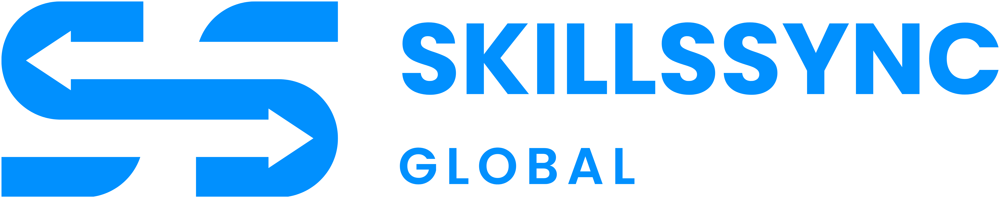

<div align="center">
  
  
  **AI-Powered Skill Extraction & Tracking Platform**

[](https://nextjs.org/)
[](https://www.typescriptlang.org/)
[](https://tailwindcss.com/)
[](https://supabase.com/)

[](https://skillsyncglobal.vercel.app)
[](LICENSE)

  <p align="center">
    <strong>Transform your documents into valuable skills with AI-powered analysis.</strong><br/>
    Track your professional development effortlessly.
  </p>

[Features](#-features) •
[Tech Stack](#-tech-stack) •
[Getting Started](#-getting-started) •
[Project Structure](#-project-structure) •
[Contributing](#-contributing)

</div>

---

## ✨ Features

<table>
  <tr>
    <td align="center" width="33%">
      
      <br/><sub>Upload coursework, projects, certifications, and any educational documents</sub>
    </td>
    <td align="center" width="33%">
      
      <br/><sub>Automatic skill extraction using advanced AI models</sub>
    </td>
    <td align="center" width="33%">
      
      <br/><sub>View skills organized by category with confidence scores</sub>
    </td>
  </tr>
  <tr>
    <td align="center" width="33%">
      
      <br/><sub>Set and track your career and learning goals</sub>
    </td>
    <td align="center" width="33%">
      
      <br/><sub>Your data is encrypted and accessible only by you</sub>
    </td>
    <td align="center" width="33%">
      
      <br/><sub>Beautiful UI with system theme support</sub>
    </td>
  </tr>
</table>

---

## 🛠 Tech Stack

### Frontend

| Technology                                                                         | Description                     |
| ---------------------------------------------------------------------------------- | ------------------------------- |
|              | React framework with App Router |
|                   | UI library                      |
|     | Type-safe JavaScript            |
|   | Utility-first CSS framework     |
|  | Accessible UI primitives        |

### Backend & Database

| Technology                                                                        | Description                          |
| --------------------------------------------------------------------------------- | ------------------------------------ |
|  | PostgreSQL database & authentication |
|              | AI-powered skill extraction          |

### Deployment & Analytics

| Technology                                                                           | Description         |
| ------------------------------------------------------------------------------------ | ------------------- |
|              | Deployment platform |
|  | Usage analytics     |

---

## 🚀 Getting Started

### Prerequisites

- **Node.js** 18.17 or later
- **pnpm** (recommended) or npm
- **Supabase** account
- **OpenAI API** key (or compatible API like DeepSeek)

### Installation

1. **Clone the repository**

   ```bash
   git clone https://github.com/yourusername/skillsync.git
   cd skillsync
   ```

2. **Install dependencies**

   ```bash
   pnpm install
   ```

3. **Set up environment variables**

   Create a `.env` file in the root directory:

   ```env
   # Supabase
   NEXT_PUBLIC_SUPABASE_URL=your_supabase_url
   NEXT_PUBLIC_SUPABASE_ANON_KEY=your_supabase_anon_key

   # OpenAI (or compatible API)
   OPENAI_API_KEY=your_openai_api_key
   OPENAI_BASE_URL=https://api.openai.com/v1  # or custom endpoint

   # App URL
   NEXT_PUBLIC_APP_URL=http://localhost:3000
   ```

4. **Set up the database**

   Run the following SQL in your Supabase SQL editor:

   ```sql
   -- Documents table
   CREATE TABLE documents (
     id UUID DEFAULT gen_random_uuid() PRIMARY KEY,
     user_id UUID NOT NULL REFERENCES auth.users(id),
     filename TEXT NOT NULL,
     file_url TEXT NOT NULL,
     status TEXT DEFAULT 'PROCESSING',
     upload_date TIMESTAMP WITH TIME ZONE DEFAULT NOW()
   );

   -- Extracted skills table
   CREATE TABLE extracted_skills (
     id UUID DEFAULT gen_random_uuid() PRIMARY KEY,
     user_id UUID NOT NULL REFERENCES auth.users(id),
     document_id UUID REFERENCES documents(id),
     skill_name TEXT NOT NULL,
     category TEXT,
     confidence_score DECIMAL(3,2),
     evidence_text TEXT,
     created_at TIMESTAMP WITH TIME ZONE DEFAULT NOW()
   );

   -- User goals table
   CREATE TABLE user_goals (
     id UUID DEFAULT gen_random_uuid() PRIMARY KEY,
     user_id UUID NOT NULL REFERENCES auth.users(id) UNIQUE,
     current_study TEXT,
     want_to_study TEXT,
     study_duration TEXT,
     career_goal TEXT,
     skill_goal TEXT,
     onboarding_completed BOOLEAN DEFAULT FALSE,
     created_at TIMESTAMP WITH TIME ZONE DEFAULT NOW(),
     updated_at TIMESTAMP WITH TIME ZONE DEFAULT NOW()
   );
   ```

   **Optional – Skills on Base (wallet + on-chain attestations):** Run migrations `scripts/007_wallet_address.sql` and `scripts/008_onchain_attestations.sql` either by:

   - **Option A:** Adding your Supabase Postgres connection string to `.env` as `DATABASE_URL` (Dashboard → Project Settings → Database → Connection string URI), then running:
     ```bash
     pnpm run db:migrate
     ```
   - **Option B:** Opening the Supabase SQL Editor and running the contents of each file in order.

5. **Run the development server**

   ```bash
   pnpm dev
   ```

6. **Open your browser**

   Navigate to [http://localhost:3000](http://localhost:3000)

---

## 📁 Project Structure

```
skillsync/
├── app/                      # Next.js App Router
│   ├── (dashboard)/          # Protected dashboard routes
│   │   ├── dashboard/        # Main dashboard
│   │   ├── documents/        # Document management
│   │   ├── skills/           # Skills overview
│   │   ├── goals/            # User goals
│   │   └── profile/          # User profile
│   ├── api/                  # API routes
│   │   ├── auth/             # Authentication callbacks
│   │   ├── documents/        # Document CRUD & analysis
│   │   ├── skills/           # Skills API
│   │   └── onboarding/       # Onboarding API
│   ├── auth/                 # Auth pages (login/register)
│   ├── onboarding/           # User onboarding flow
│   └── page.tsx              # Landing page
├── components/               # Reusable components
│   ├── auth/                 # Auth components
│   ├── dashboard/            # Dashboard components
│   ├── documents/            # Document components
│   ├── skills/               # Skills components
│   └── ui/                   # UI primitives (shadcn/ui)
├── lib/                      # Utility functions
│   ├── db.ts                 # Database operations
│   ├── openai.ts             # OpenAI client
│   ├── supabase/             # Supabase clients
│   └── utils.ts              # Helper functions
└── public/                   # Static assets
```

---

## 🔑 Key Features Explained

### 📄 Document Analysis Pipeline

1. **Upload** - Users upload documents (text files, coursework, projects)
2. **Processing** - Documents are sent to AI for analysis
3. **Extraction** - AI extracts skills with categories and confidence scores
4. **Storage** - Skills are stored and linked to user profiles
5. **Display** - Skills appear in the dashboard with evidence text

### 🎯 Goal Tracking

Users can set and track:

- **Career Goals** - Ultimate career aspirations
- **Current Studies** - What they're currently learning
- **Skill Goals** - Specific skills they want to develop
- **Top Priorities** - Current focus areas

### 🔐 Authentication

- **Email/Password** - Traditional authentication
- **Google OAuth** - One-click sign-in with Google
- **Session Management** - Secure, persistent sessions via Supabase

---

## 📱 Screenshots

<div align="center">
  <table>
    <tr>
      <td align="center">
        <strong>Landing Page</strong><br/>
        <sub>Modern, responsive landing page</sub>
      </td>
      <td align="center">
        <strong>Dashboard</strong><br/>
        <sub>Skill tracking overview</sub>
      </td>
    </tr>
    <tr>
      <td align="center">
        <strong>Skills View</strong><br/>
        <sub>Categorized skill display</sub>
      </td>
      <td align="center">
        <strong>Goals</strong><br/>
        <sub>Career goal tracking</sub>
      </td>
    </tr>
  </table>
</div>

---

## 🤝 Contributing

Contributions are welcome! Please feel free to submit a Pull Request.

1. Fork the repository
2. Create your feature branch (`git checkout -b feature/AmazingFeature`)
3. Commit your changes (`git commit -m 'Add some AmazingFeature'`)
4. Push to the branch (`git push origin feature/AmazingFeature`)
5. Open a Pull Request

---

## 📄 License

This project is licensed under the MIT License - see the [LICENSE](LICENSE) file for details.

---

## 🙏 Acknowledgments

- [Next.js](https://nextjs.org/) - The React Framework
- [Supabase](https://supabase.com/) - Open source Firebase alternative
- [shadcn/ui](https://ui.shadcn.com/) - Beautiful UI components
- [Lucide Icons](https://lucide.dev/) - Beautiful icon library
- [Tailwind CSS](https://tailwindcss.com/) - Utility-first CSS framework

---

<div align="center">
  
  **Made with ❤️ by [CodeWithEugene](https://codewitheugene.top/)**
  
  [](https://codewitheugene.top/)
  
</div>
